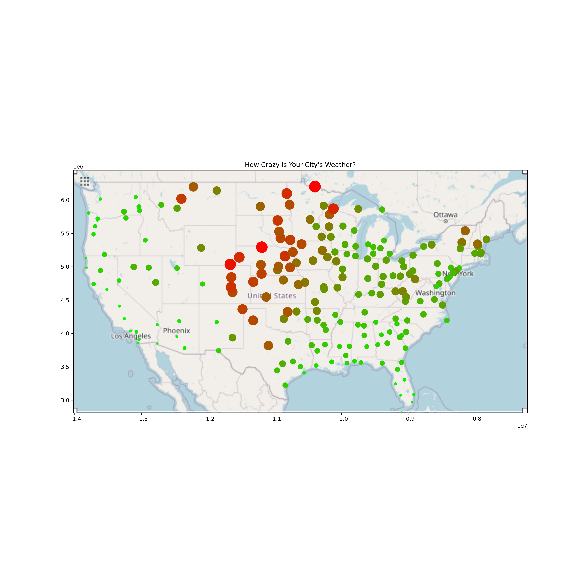

# Weather Craziness Analysis
Many people claim that the weather in their state is crazy, so I decided to test it. I took average weather data from 100 cities and computed the mean squared absolute difference in between the high of one day and the high of the next. I also did the same with the lows. Then I plotted the us map with the larger circle being more variable weather. 

